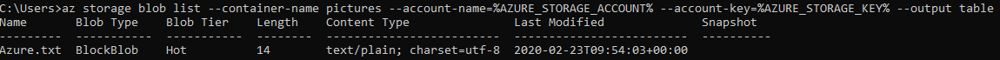

# Week 4 - Azure Storage - List the blobs in the container

## 1. Azure CLI - through PowerShell

```powershell
az login
$env:AZURE_STORAGE_ACCOUNT="<account-name>"
$env:AZURE_STORAGE_KEY="<account-key>"
az storage blob list --container-name pictures --output table
```


## 2. Azure CLI - through CMD

```cmd
::current shell environment values
set AZURE_STORAGE_ACCOUNT="<account-name>"
set AZURE_STORAGE_KEY="<account-key>"

az login
az storage blob list --container-name pictures --account-name=%AZURE_STORAGE_ACCOUNT% --account-key=%AZURE_STORAGE_KEY% --output table
```


```cmd
::cmd shell 1
::global user environment values
setx AZURE_STORAGE_ACCOUNT "<account-name>"
setx AZURE_STORAGE_KEY "<account-key>"
::cmd shell 2
az login
az storage blob list --container-name pictures --output table
```


## 3. .NET SDK
```cmd
setx AZURE_STORAGE_CONNECTION_STRING "<yourconnectionstring>"
```
[Program.cs](BlobStorageSDK/BlobStorageSDK/Program.cs)

## 4. REST API 

The documentation below shows curl requests but it is easier to use Postman.

[Azure REST API Reference](https://docs.microsoft.com/en-us/rest/api/azure/)

[Azure REST APIs with Postman in 2 Minutes](https://blog.jongallant.com/2017/11/azure-rest-apis-postman/)


1. Create Service Principal
* Command:
```cmd
az ad sp create-for-rbac -n "sp-szkola-chmury"
```
* Result:
```cmd
Changing "sp-szkola-chmury" to a valid URI of "http://sp-szkola-chmury", which is the required format used for service principal names
Creating a role assignment under the scope of "/subscriptions/<subscription>"
  Retrying role assignment creation: 1/36
  Retrying role assignment creation: 2/36
{
  "appId": "<appId>",
  "displayName": "sp-szkola-chmury",
  "name": "http://sp-szkola-chmury",
  "password": "<password>",
  "tenant": "<tenant>"
}
```

2. Assign Role: "Storage Blob Data Reader" for the Service Principal to the Storage Account


3. Get AAD Token

* Request:
```cmd
curl --location --request POST "https://login.microsoftonline.com/<tenant>/oauth2/token" \
--header "Content-Type: application/x-www-form-urlencoded" \
--data-urlencode "grant_type=client_credentials" \
--data-urlencode "client_id=<appId>" \
--data-urlencode "client_secret=<password>" \
--data-urlencode "resource=https://<storage-account>.blob.core.windows.net/"
```
* Response:
```cmd
{
    "token_type": "Bearer",
    "expires_in": "3599",
    "ext_expires_in": "3599",
    "expires_on": "1582501804",
    "not_before": "1582497904",
    "resource": "https://<storage-account>.blob.core.windows.net/",
    "access_token": "<token>"
}
```

4. List blobs with Bearer Token authorisation

* Request:
```cmd
curl --location --request GET "https://<storage-account>.blob.core.windows.net/pictures?restype=container&comp=list" \
--header "x-ms-version: 2018-03-28" \
--header "x-ms-date: Sun, 23 Feb 2020 23:40:44 GMT" \
--header "Authorization: Bearer <token>"
```
* Response in Postman:


## 5. Storage Explorer

[Azure Storage Explorer](https://azure.microsoft.com/en-us/features/storage-explorer/)

